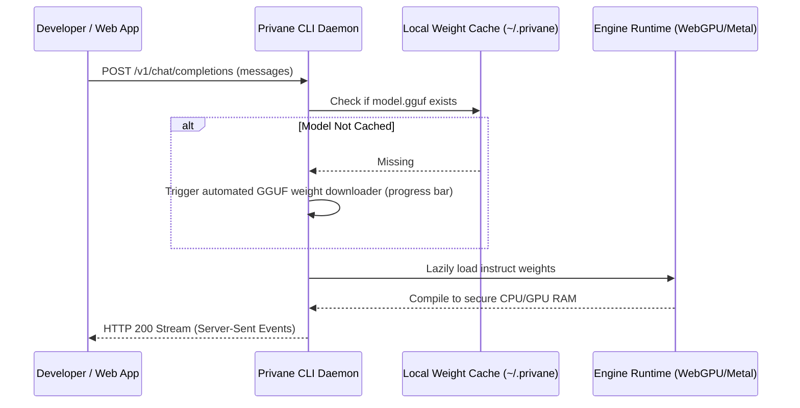

# Privane: Sovereign Local-First AI Runtime

<p align="center">
  <b>Reason locally. Execute globally.</b>
</p>

<p align="center">
  <a href="https://github.com/privane-ai/privane-core">
    
  </a>
  <a href="https://npmjs.com/org/privane">
    
  </a>
</p>

---

Privane is the **execution infrastructure for sovereign AI**. It enables developers to construct autonomous, production-grade AI software agents that run heavy cognitive reasoning loops fully locally on native hardware, while securely delegating complex outbound web actions to managed cloud execution gates.

---

## ⚡ Genuinely Useful Locally

We believe open-source AI tools should never feel crippled or behave as a "bait-and-switch" for SaaS products. Privane's open-core monorepo is **100% complete and fully featured locally**—running completely offline on native CPU/GPU hardware.

---

## ⚙️ How It Works (The Local Lifecycle)

Privane is built around a completely automated, zero-configuration local workflow:



### 1. Fire Up the Server Daemon
Expose an OpenAI-compliant completions endpoint running locally at `http://localhost:8080/v1`:
```bash
node packages/cli/dist/index.js serve
```

### 2. Auto-cached Lazy Weight Pulling
When you dispatch your first completion request, the server automatically checks your local cache. If the model weights are missing, it triggers an automated download with a live ticking progress bar directly in your terminal:
```text
📥 Initiating GGUF weight pull from secure CDN for [gemma-2b-instruct]...
File: gemma-2b-instruct.gguf (approx 2.15 GB)
Downloading: [■■■■■■■■■■░░░░░░░░░░] 50% (1075.0MB/2150MB) | 48.2 MB/s
```

### 3. Stream and Chat Natively
Once the cache is validated, the GGUF weights compile to secure local volatile RAM instantly, and the server begins streaming token-by-token deltas back to your client.

---

## 📦 Monorepo Cohesion (The 3 Pillars)

To preserve strong architectural cohesion, the Privane ecosystem is concentrated into exactly **three core workspace packages**—preventing package fragmentation:

1. **[`@privane/engine`](packages/engine)** — Browser-native local AI runtime with WebGPU acceleration.
2. **[`@privane/tools`](packages/tools)** — Unified local and cloud tool execution SDK for AI agents.
3. **[`privane-cli`](packages/cli)** — CLI runtime and OpenAI-compatible local AI server.

---

## 🚀 Quickstart

Get the workspace running locally on your development machine:

### 1. Install Dependencies
```bash
npm install
npx tsc -b
```

### 2. Launch Local Server Daemon
```bash
node packages/cli/dist/index.js serve
```

### 3. Chat with the Model (OpenAI-Compatible)
Since the server exposes standard, fully compliant completions endpoints, you can chat with it using standard clients:

#### Option A: Direct terminal stream (curl)
```bash
curl http://localhost:8080/v1/chat/completions \
  -H "Content-Type: application/json" \
  -d '{
    "model": "gemma-2b-instruct",
    "messages": [{"role": "user", "content": "What is a sovereign AI?"}],
    "stream": true
  }'
```

#### Option B: standard Node.js / Python SDKs
```javascript
import OpenAI from 'openai';

const openai = new OpenAI({
  baseURL: 'http://localhost:8080/v1',
  apiKey: 'local-key-ignored'
});

const response = await openai.chat.completions.create({
  model: 'gemma-2b-instruct',
  messages: [{ role: 'user', content: 'What is a sovereign AI?' }]
});
console.log(response.choices[0].message.content);
```

#### Option C: Terminal Chat (Zero-Config)
You don't need any browser page or HTTP client script. Launch an interactive streaming chat loop directly inside your terminal with:
```bash
node packages/cli/dist/index.js chat
```
*Note: This will automatically check model caches, trigger the progress bar download if missing, compile it to CPU/GPU memory, and boot a highly responsive interactive chat loop (`user> / assistant>`) natively.*

#### Option D: Visual Web Workspace (Next.js Dashboard)
You can boot your Next.js workspace dashboard to chat with the model inside a beautiful Generative UI:
```bash
cd ../privane-web
npm run dev
```
*Open `http://localhost:3000` in your browser and open the Chat tab to start chatting.*

---

## 🚀 Built with Privane

Developers use the Privane runtime to build secure, offline-first AI applications:
* 💻 **Local AI Copilots:** Code completions and review loops directly in terminal interfaces.
* 🌐 **Sovereign Browser Agents:** Virtualized web scrapers that reason locally before performing state updates.
* 🏢 **Internal Enterprise Assistants:** Secure document search tools that never leak proprietary context.
* 🔌 **Offline AI Systems:** Volunteer networks and remote devices working without active network feeds.
* 🐙 **GitHub Workflow Agents:** Automated pull request scanners analyzing code blocking team tasks.

---

## 📄 License

Privane is released under the **Apache-2.0 License**. Build sovereign agents freely!
