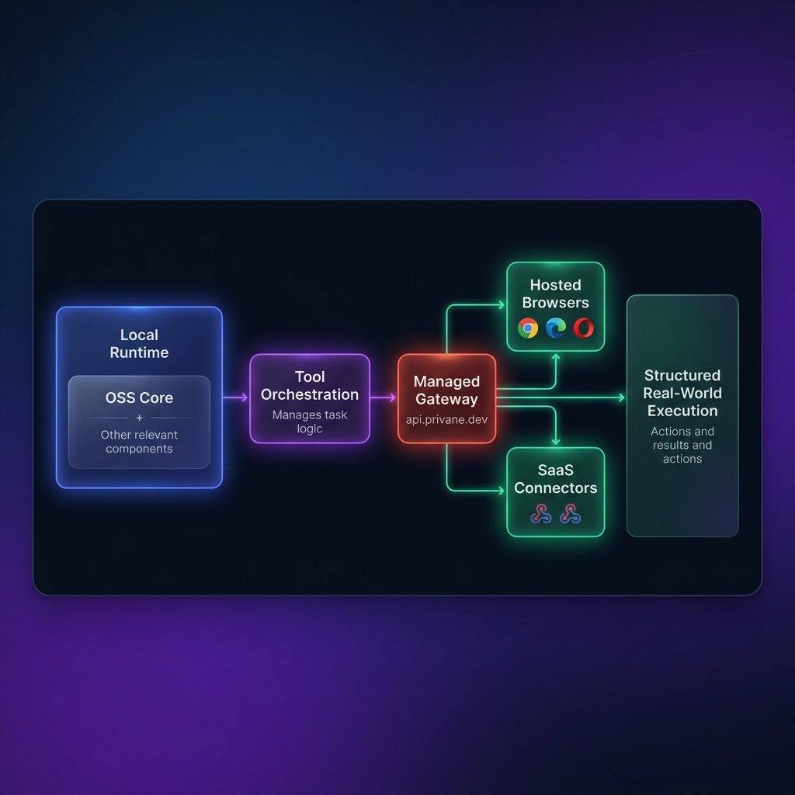

# Privane: Sovereign Local-First AI Runtime

<p align="center">
  <b>Reason locally. Execute globally.</b>
</p>

<p align="center">
  <a href="https://github.com/privane-ai/privane-core">
    
  </a>
  <a href="https://npmjs.com/org/privane">
    
  </a>
</p>

---

Privane is the **execution infrastructure for sovereign AI**. It enables developers to construct autonomous, production-grade AI software agents that run heavy cognitive reasoning loops fully locally on native hardware, while securely delegating complex outbound web actions to managed cloud execution gates.

---

## ⚡ Genuinely Useful Locally

We believe open-source AI tools should never feel crippled or behave as a "bait-and-switch" for SaaS products. Privane's open-core monorepo is **100% complete and fully featured locally**—running completely offline on native CPU/GPU hardware. 

Outbound cloud gates (like headless Chromium clusters and SaaS connector bridges) are completely optional **enhancements** to expand your agent's capabilities globally, rather than a proprietary locking gate.

---

## 📌 Unified Architecture

The diagram below outlines how the open-source client-side modules of the Privane developer operating system delegate commands to stateless managed gateways and hosted browsers:

<p align="center">
  
</p>

---

## 📦 Monorepo Cohesion (The 3 Pillars)

To preserve strong architectural cohesion, the Privane ecosystem is concentrated into exactly **three core workspace packages**—preventing package fragmentation:

1. **[`@privane/engine`](file:///Users/malik/Downloads/sivra-website/privane-core/packages/engine)** — Browser-native local AI runtime with WebGPU acceleration.
2. **[`@privane/tools`](file:///Users/malik/Downloads/sivra-website/privane-core/packages/tools)** — Unified local and cloud tool execution SDK for AI agents.
3. **[`privane-cli`](file:///Users/malik/Downloads/sivra-website/privane-core/packages/cli)** — CLI runtime and OpenAI-compatible local AI server.

---

## ⚡ The Magic Demo (PR Standup Synthesizer)

Privane is highly visual. Running `node magic-demo.js` executes a complete standalone hybrid orchestration sequence in a secure loop:

1. **Local Weight Loading:** Lazily loads `gemma-2b-instruct` in secure, volatile system memory on your local machine.
2. **Stateless GitHub Gateway Scan:** Fetches unread engineering notifications via secure, stateless cloud connect gates.
3. **Headless Browser Virtualization:** Commands a headless cloud browser session (integrated with PinchTab/Browserbase) to scan target pull requests.
4. **Cloud-Side DOM Pruning:** Compresses raw PR layout HTML into clean, high-signal accessibility trees, achieving **95.3% token savings** before returning it local-side.
5. **Private Local Reasoning:** The local model summarizes codebase edits and isolates team blockers fully on secure local CPU/GPU silicon.
6. **Slack Standup Dispatch:** Secures Standup digest notification offloads to team channels via cloud gateway webhooks.

---

## 🚀 Built with Privane

Developers use the Privane runtime to build secure, offline-first AI applications:
* 💻 **Local AI Copilots:** Code completions and review loops directly in terminal interfaces.
* 🌐 **Sovereign Browser Agents:** Virtualized web scrapers that reason locally before performing state updates.
* 🏢 **Internal Enterprise Assistants:** Secure document search tools that never leak proprietary context.
* 🔌 **Offline AI Systems:** Volunteer networks and remote devices working without active network feeds.
* 🐙 **GitHub Workflow Agents:** Automated pull request scanners analyzing code blocking team tasks.

---

## 🚀 Quickstart

Initialize the local background REST server daemon and fetch chat completions streams using your own quantized weights:

### 1. Install Workspace Dependencies
```bash
npm install
npx tsc -b
```

### 2. Launch Local Server Daemon
```bash
node packages/cli/dist/index.js serve
```
*Exposes a standard OpenAI-compatible API running locally at `http://localhost:8080/v1`.*

### 3. Fetch Local Chat Completion Streams
```javascript
import { Engine } from '@privane/engine';

const engine = new Engine();
await engine.load('gemma-2b-instruct');

const stream = engine.generate({ prompt: "Synthesize team blockers for PR #12." });
for await (const token of stream) {
  process.stdout.write(token);
}
```

---

## 🛡️ The Single Most Important Boundary

We enforce a strict physical boundary separating sovereign offline execution from metered cloud systems:

| Local & Keyless (100% Free & Offline) | Managed Cloud Gates (Requires API Key) |
| :--- | :--- |
| **Local Inference:** Gemma / Llama CPU/GPU execution | **GitHub Gateway:** Managed OAuth scopes & token persistence |
| **Local Tools:** Sandboxed filesystem (`LocalFileSystemTool`) | **Slack Gateway:** Webhook proxy gates & dispatch routing |
| **Offline Databases:** Safe SQLite query filters (`LocalSqliteTool`) | **Hosted Browsers:** Heavy Playwright clusters and DOM pruners |
| **Core SDKs:** Standard packages and type interfaces | **Cloud Routing:** Distributed session proxies |

---

## 🔒 Context Sovereignty & Zero-Storage Promise

We maintain a strict zero-knowledge core. **Privane Cloud never stores or records:**
* Raw prompts, templates, or system instruction payloads.
* Local filesystem workspaces or directory paths.
* SQLite database schemas or outputs.

We only store transient, encrypted OAuth access states to negotiate SaaS connection gates, flushing all payload variables instantly from memory upon execution.

---

## 🤝 Infrastructure Ecosystem Partners (Looking for Partners!)

We are actively seeking compute, vector index, and browser virtualization infrastructure partners to help expand our open-source sovereign AI execution ecosystem. If your team builds in these categories, please reach out to collaborate!

* **Compute & GPU Infrastructure:** Standardizing high-throughput local and remote edge compute integrations.
* **Browser Virtualization Clusters:** Gating headless automation sessions to secure remote virtual clusters.
* **Vector & Memory Indexers:** Standardizing low-latency private semantic searches natively on secure silicon.

---

## 📄 License

Privane is released under the **Apache-2.0 License**. Build sovereign agents freely!
